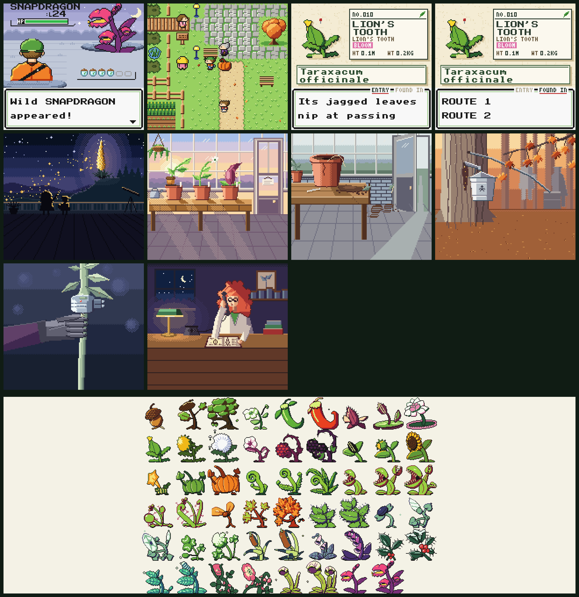

# Verdant Reach

**[▶ Play in your browser](https://minormending.github.io/verdant-reach/)**: keyboard, or touch on phones and tablets.



A Game Boy Color–style monster collector in which every creature is a real
plant. You're a junior botanist. The night a once-a-century flower blooms,
certain plants across the valley wake up, and your job is to catalogue the
QUICKENED. Then you find out who woke them, and why.

This is a **vertical slice**: the Prologue through Chapter 5 (Cedarhallow and
the Burnt Stand), ending at Conservatory 4, a few hours of play. The story bible lives in
[docs/story/](docs/story/).

## Play

```bash
npm install
npm run dev
```

Then open http://localhost:5173. For a production build, run `npm run build`
and serve `dist/` with any static server.

| Button | Keys |
|---|---|
| Move | Arrows / WASD (hold **B** to run) |
| A | Z, Space, J |
| B | X, Esc, Backspace, K |
| START (menu) | Enter |
| SELECT | Shift |

On phones and tablets, an on-screen D-pad and buttons appear automatically.
Press **F** (or the corner button) for fullscreen. Time of day follows your
real clock: morning 4–10, day 10–18, night 18–4. Some plants only appear at
night. Add `?time=morning|day|night` to the URL to override it.

## What's in the slice

- **35 hand-composed maps.**
  - Fallowfield's farms and windmill, Hedgerow's lanes, brick-and-bramble Bramblegate, and autumnal Sugarbush.
  - The Night Meadow, and the Sugarbush Grove dungeon.
  - **Glasshouse City** under its vast glass dome: the Root Relay, the Nursery Garden, the tropical Palm House, the big market, and the Route 4 orchard on the way in.
  - **Chapter 5:** Route 6's misty old-growth canopy walkway, Cedarhallow (a town among living cedars), the fire-scarred Burnt Stand and the Hollow shrine inside the oldest cedar.
  - Four Conservatory puzzles: Hollis's lever-gated hedge maze, Nell's bog valves, Flora's rose-trellis maze and Morrow's dark Conservatory, where the safe path shows only in the lantern's light.
- **52 trainers.** Leaders HOLLIS (Wood), NELL PITCHER (Bug), FLORA VANCE (Bloom, the difficulty spike) and MORROW (Ghost), rival BRAM ×4 (the fourth time with a graft-collared partner), and ROOTSTOCK grunts with their admin SHEARS. Staged cutscenes use camera pans, flashes and ambience.
- **78 species, 97 moves and 9 types.** Every species is a real plant that grows through its real life stages, poses as a creature in battle and has an idle animation. Every Herbarium entry contains a fact-checked true fact and shows where the species is FOUND.
- **Systems:**
  - Crystal-style battles with a modern feel: the physical/special split, statuses, weather, critical captures, SUPER/WEAK hints, and 40 move-animation families.
  - Catching with nicknames, and growth (evolution) by level, by time of day and by friendship.
  - **The Nursery Garden:** board two plants that share a pollination group and they set a SEED, which sprouts in your party as you walk.
  - **Field moves:** PRUNE clears brambles, opening shortcuts and hidden stashes across the old routes.
  - **Item growth:** EMBER ASH opens a sealed lodgepole cone, the way real fire-cones need fire to release their seed. The FOXFIRE LANTERN lights dark maps.
  - Party (with move reordering), bag, a pressed-specimen Field Herbarium, storage cabinet, shop and options.
  - Saving, whiteout, real-time day and night with lamp-lit nights, and ambient particles (pollen, leaves, fireflies, mist).
  - **Side content:** eleven side quests tracked in a NOTES log, 26 hidden items, and berry and rose-hip bushes that regrow each real day.
  - **Your lead Quickened follows you** around the overworld (toggle in OPTIONS).
  - **Ten illustrated stills** at key story moments.
- **An original chiptune soundtrack:** 27 tracks, jingles, sound effects, a cry per species, and ambient wind, bird and cricket beds, all synthesised live with WebAudio.
- **Art:** all hand-built pixel art, stored as swappable bundles in `public/art/` (a folder of PNGs plus JSON per creature, tileset, structure and character; format in [docs/ART.md](docs/ART.md)). Every species follows the Crystal rule (shared black outline and white highlights, two species tones, a per-species entrance animation; [docs/CREATURES.md](docs/CREATURES.md)). Art packs override any subset: try `?art=classic` for the pre-Crystal sprites or `?art=traced` for the original photo-traced ones.
  - 78 species with idle animations, true back views and a real-cultivar shiny ("sport") palette each ([docs/SPORTS.md](docs/SPORTS.md)), to the creature design guide in `docs/CREATURES.md`.
  - Autotiled environments with ground variation.
  - Unique characters with weighted walk cycles, and trainer portraits.
  - Title art.
  - Species were drawn from real-plant photo references; the photo credits are in `public/art/CREDITS.md`.

## Development

| | |
|---|---|
| `npm run typecheck` | strict TypeScript |
| `npm test` | vitest: 691 tests, including world validation, puzzle solvability, trainer-blocking and a boss-balance simulation |
| `?dev=<module>` | isolated dev scenes: `battle`, `screens`, `audio` (jukebox), `ui`, `overworld`, `world`, and `art` (the **Art Lab**: browse and live-swap every art bundle) |
| `?dev=world&play=1&map=<id>&flags=a,b&species=<id>&level=<n>` | drop into any story state |
| `npm run e2e` | headless full playthrough (73 beats through Chapter 5, about 11 minutes; first use: `npx playwright install chromium`). CI runs it before every deploy. |

The art lives in `public/art/` and the game reads it directly: edit a PNG,
reload, and it's in the game. The Python tools in `tools/art/` (Pillow +
NumPy; any Python 3.12+ environment with `pillow` and `numpy` will do) work on
those bundles:
- `python tools/art/art.py …` lists, validates, previews, explodes and repacks
  tilesets, swaps sprites and edits palettes;
- `python tools/art/build_all.py` validates and rebuilds `public/art/index.json`;
- `--regen` re-runs the generators, which reproduce every generated bundle
  byte-for-byte and never touch hand-edited ones.

See docs/ART.md §11.

Architecture, ownership and conventions: [docs/ARCHITECTURE.md](docs/ARCHITECTURE.md).
Slice scope: [docs/SLICE.md](docs/SLICE.md).
Contracts shared by all modules: `src/contracts/`.

## Known limitations

- **The audio was mixed by measurement only.** Levels were set with offline renders; a human listening pass is still worthwhile.
- **Balance comes from simulation and automated play** (`src/battle/logic/balance.test.ts`, `e2e/`). Human play-testing should still tune feel.
- **Scope:** Chapters 6–11 of the story bible (Conservatories 5–8, the Council) and the post-game are built on feature branches and land here as each chapter's dialogue is written. A modern restyle (a wider 320×180 screen with new art) is in progress on the `restyle` branch.
